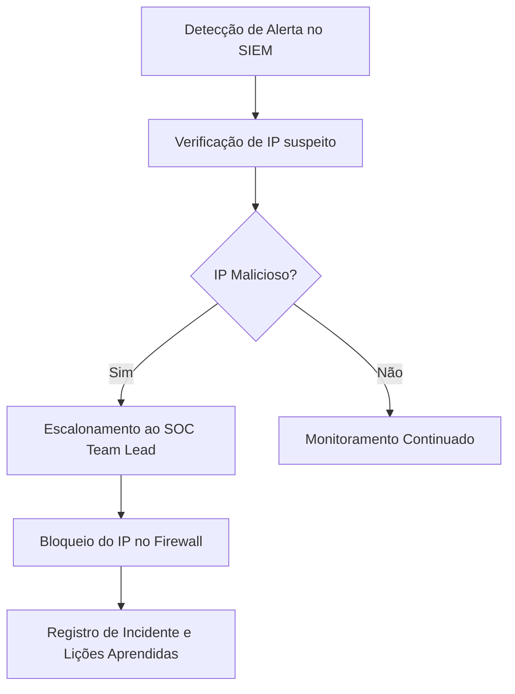

# Defensive Security Lab – SOC & DFIR Simulation

Laboratório prático simulando **Security Operations Center (SOC)**, **Threat Intelligence**, **Digital Forensics & Incident Response (DFIR)** e **Malware Analysis**. Objetivo: documentar experiência prática em **Blue Teaming**.

---

## 1. Áreas de Segurança Defensiva

| Área                        | Descrição |
|------------------------------|-----------|
| SOC (Security Operations Center) | Monitora redes/sistemas e detecta eventos maliciosos. |
| Threat Intelligence           | Coleta informações sobre adversários e ataques potenciais. |
| DFIR (Digital Forensics & Incident Response) | Analisa evidências de ataque e responde a incidentes. |
| Malware Analysis              | Estuda comportamento de softwares maliciosos (estática/dinâmica). |

---

## 2. Fluxo de Resposta a Incidentes

